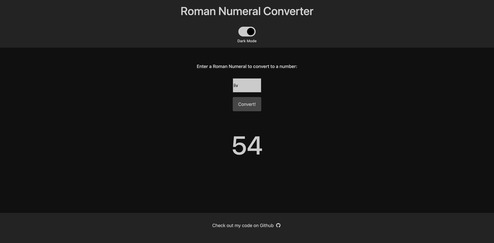

# Roman Numeral Converter

## Description

Simple and clean Roman Numeral converter app with switchable and automatically scheduled dark mode.

## Table of Contents
- [Roman Numeral Converter](#roman-numeral-converter)
  - [Description](#description)
  - [Table of Contents](#table-of-contents)
    - [Usage](#usage)
    - [License](#license)
    - [Contributing](#contributing)
    - [Test Instructions](#test-instructions)
    - [Links](#links)
    - [Questions](#questions)

### Usage

 Visit the app [here](https://dimitermusic.github.io/roman-numeral-converter.html/)!

### License

This project is using the MIT license.

### Contributing

All contributions and feedback welcome!

### Test Instructions

No tests at this time.

### Links

[Deployed App](https://dimitermusic.github.io/roman-numeral-converter.html/)  

[Github](https://github.com/dimitermusic/roman-numeral-converter)  

### Questions

[Github](https://www.github.com/dimitermusic)

[Email](mailto:dimitermusic@gmail.com)
